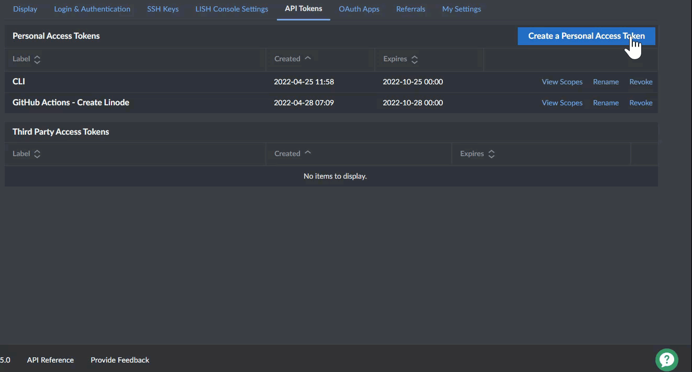
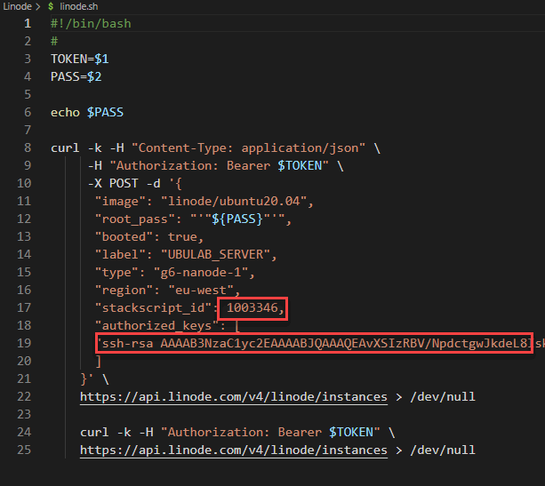
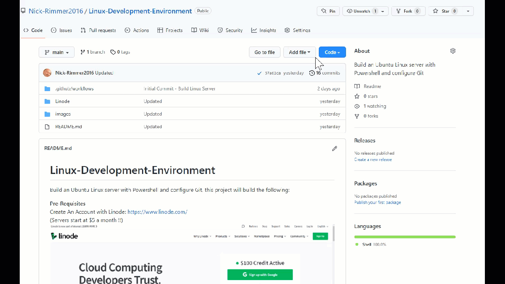

# Linux-Development-Environment
Build an Ubuntu Linux server with Powershell and configure Git, this project will build the following:   

**Pre-Requisites**   
* Create An Account with Linode:  https://www.linode.com/    
  (Servers start at $5 a month !!)   
  
* Create a SSH key pair   
* Upload public key to Linode `MyProfile\SSH Keys`   
* Create an [API token](https://www.linode.com/docs/guides/api-key/) for Linode, select Linodes only for Read\Write   

     

### Deployment   

* Place linode.yml in .github\workflows   
* Copy the contents of apps.sh and import into StackScripts in Linode, take a note of the id number for the script.   
     
  This script will execute once the linux server is built.   
* Edit the `linode.sh` script and the id for the stackscript.   
     
* Add the secrets to your repository to be used for root password and the API Token. (root password is a password of your choice)   
  PASS = `<Your root password>`   
  TOKEN = `<API Token created in Linode>`   
  

**Operating System**   
Ubuntu v20.04   

**Applications**   
PowerShell v7.xx   
Python v3.xx   

**Configuration**   
Creates a folder called projects in the root of the file system `\projects`   
Configures your name and email for Git Version Control   
Clones a github repository to the `projects` folder   

**Automation**   
Github Actions is used to automate the environment creation, at the moment when a push is made to this repository it initiates the creation of the VM in linode.     